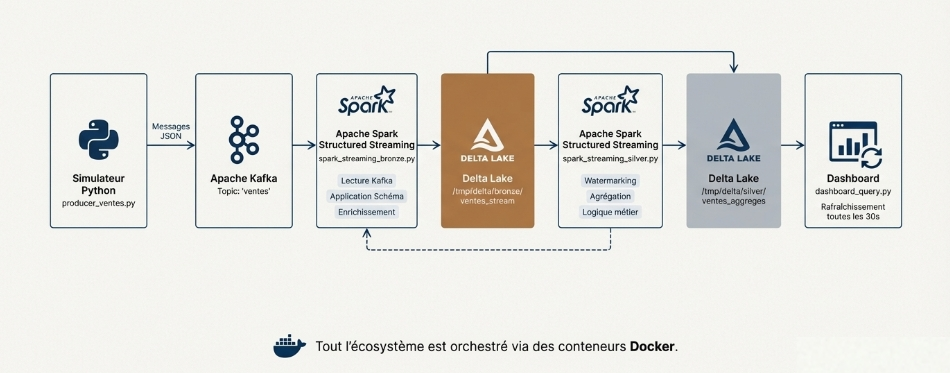

# End-to-End-Streaming-Analytics-with-Delta-Lake
This project implements an end to end real time data analytics platform for sales events. It ingests transactional data as a continuous stream, stores it reliably using a Delta Lake lakehouse architecture, and exposes business ready analytics through structured queries and dashboards.
The pipeline follows a Bronze to Silver architecture:

* Bronze layer captures raw sales events from Kafka with no business assumptions, ensuring data traceability and replayability.

* Silver layer transforms and aggregates the data into clean, query optimized datasets with business metrics such as revenue, purchase frequency, customer segmentation, and time windowed trends.

* Delta Lake is used to provide ACID transactions, schema evolution, and time travel, allowing safe concurrent reads and writes while preserving historical correctness.

The analytics layer demonstrates real time business insights including:

- Revenue breakdown by country and customer segment

- Hourly revenue and sales volume trends

- Customer loyalty indicators

- Detection of one time high value purchases

- Global operational monitoring metrics

This project showcases modern streaming data engineering practices combining Kafka, Spark Structured Streaming, and Delta Lake to build reliable, scalable, and auditable analytical systems.

## Dashboard Preview

